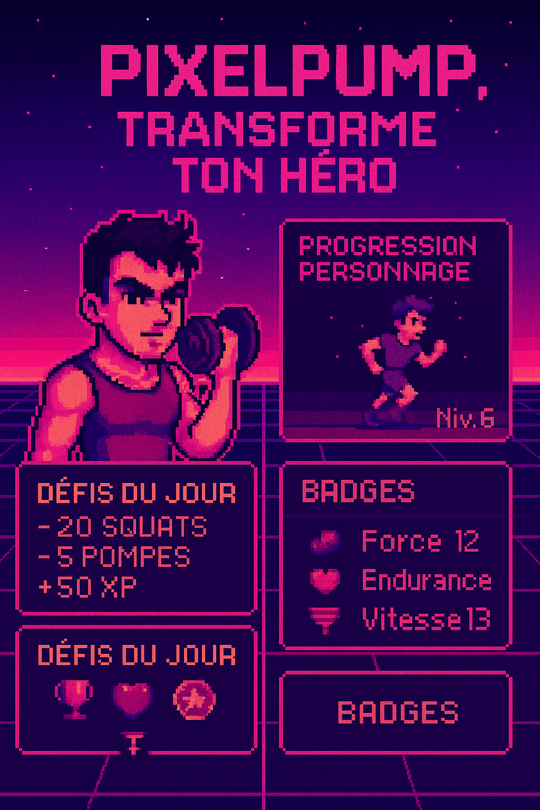
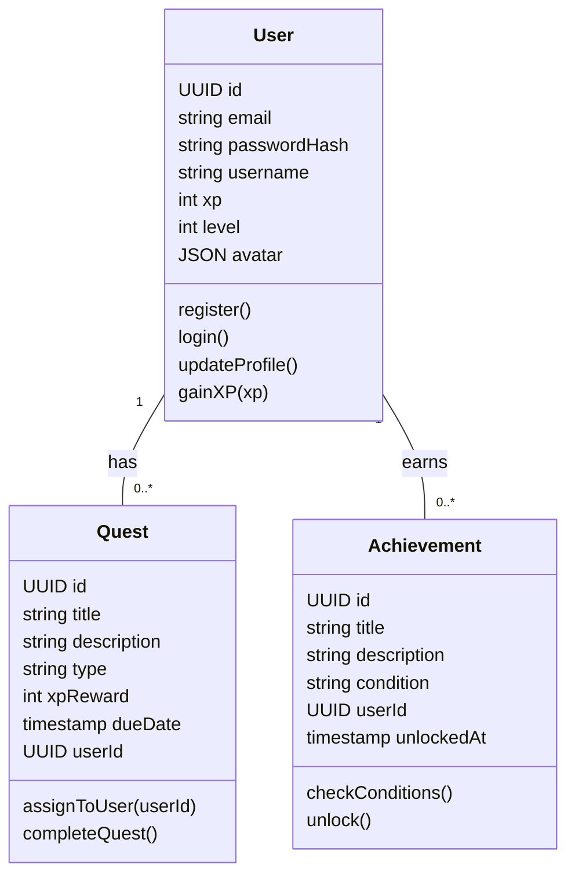
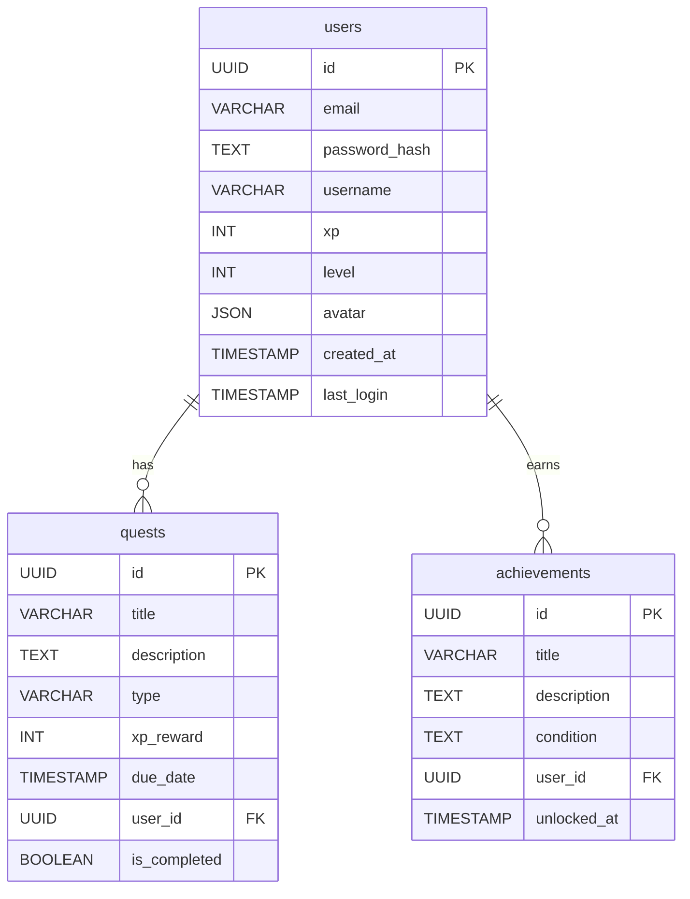

# 📘 Portfolio Project - Team Formation and Idea Development (Stage 1) (Completed)

**Team Members:**  
Gwendal Martin & Guillaume Bouvier

---

## 📌 Table of Contents – Stage 1 Report 

---

- 🧑‍🤝‍🧑 [Team Formation Overview](#team-formation-overview)
- 🧠 [Research and Brainstorming](#research-and-brainstorming)
  - 🔁 [SCAMPER Application](#scamper-application)
  - 🧭 [Mind Mapping](#mind-mapping)
- 💡 [Ideas Explored and Evaluated](#ideas-explored-and-evaluated)
- 🎯 [MVP Concept Selected](#mvp-concept-selected)
- 🚧 [Challenges and Opportunities](#challenges-and-opportunities)
- 📱 [Mobile Export Challenges](#mobile-export-challenges)
- 📄 [Conclusion](#conclusion)

---

## Team Formation Overview

From the outset, Guillaume and I discovered a shared vision and complementary strengths, fostering a collaborative and innovative environment. Our mutual enthusiasm for blending fitness with gamification set the tone for our project.

- **Gwendal Martin** focused on organizational structure and documentation, ensuring clear communication and progress tracking.  
- **Guillaume Bouvier** brought analytical prowess and technical insights, driving the brainstorming and evaluation processes.

We established regular meetings and utilized tools like **Google Docs** and **Discord** to maintain seamless communication and collaboration.

---

## Research and Brainstorming

Our ideation process was enriched by employing the **SCAMPER technique** and **Mind Mapping**, which allowed us to explore various dimensions of potential ideas.

### SCAMPER Application:

- **Substitute**: Replacing traditional workout tracking with RPG-style quests.  
- **Combine**: Merging fitness routines with gaming elements to enhance user engagement.  
- **Adapt**: Tailoring gaming mechanics to suit fitness goals and user preferences.  
- **Modify**: Adjusting difficulty levels to cater to different fitness levels.  
- **Put to another use**: Utilizing game progression systems to motivate physical activity.  
- **Eliminate**: Removing monotonous workout logs in favor of interactive challenges.  
- **Reverse**: Shifting the perspective from fitness as a chore to an adventurous journey.

### Mind Mapping:

We created a central node labeled **“Gamified Fitness App”** and branched out into categories such as:
- User Engagement  
- Technical Feasibility  
- Market Trends  
- Potential Challenges  

This visual representation helped us identify connections and prioritize features.

---

## Ideas Explored and Evaluated

### 1. Gamified Fitness App with Quests  
- **Strengths**: High user engagement, innovative approach  
- **Weaknesses**: Requires careful balance between game mechanics and fitness goals  
- **Decision**: ✅ Selected as MVP

### 2. Fitness App with AR Rewards  
- **Strengths**: Immersive user experience  
- **Weaknesses**: High development complexity and device compatibility issues  
- **Decision**: ❌ Rejected

### 3. Real-time Progress Tracker  
- **Strengths**: Simplicity and ease of implementation  
- **Weaknesses**: Lacks unique engagement factors  
- **Decision**: ❌ Rejected

### 4. AI-Powered Coaching App  
- **Strengths**: Personalized user experience  
- **Weaknesses**: High resource requirements and complexity  
- **Decision**: ❌ Rejected

---

## MVP Concept Selected

**Chosen Idea**: *Gamified Fitness App with Quests*

### Rationale:

This concept aligns with our goal to make fitness engaging and accessible. By integrating game elements, users are motivated to complete physical activities to progress in the game, fostering consistency and enjoyment.

### Target Audience:

Individuals aged **18–35** who are interested in fitness and gaming, seeking a fun and interactive way to stay active.

### Key Features:

- **Quest System**: Daily fitness challenges presented as game quests  
- **Experience Points (XP)**: Rewards for completing activities, leading to level-ups  
- **Achievements**: Badges and milestones to recognize user progress  
- **Avatar Customization**: Personalization options unlocked through consistent activity

---

## Challenges and Opportunities

### Challenges:
- Ensuring the game elements enhance rather than distract from fitness goals  
- Maintaining user engagement over time

### Opportunities:
- Potential for community features to foster social interaction  
- Expansion into different fitness levels and goals

---

## Mobile Export Challenges

During development, we encountered difficulties exporting the application to mobile platforms, particularly regarding:
- Performance optimization  
- User interface scalability

### Request for Insights:

We would greatly appreciate any **advice or strategies from Kevin Pelissard** on effectively exporting web applications to mobile platforms, ensuring optimal performance and user experience.

---

## Conclusion

Our collaborative efforts have led to the development of a **promising MVP** that merges fitness and gaming to promote a healthier lifestyle. We are committed to refining this concept and overcoming technical challenges to deliver an engaging and effective application.

# 📘 Portfolio Project - Project Charter Development (Stage 2) (Completed)

---

## 📌 Table of Contents – Stage 2: Project Charter

---

- 🎯 [Project Purpose and Objectives](#project-purpose-and-objectives)
  - 📌 [Purpose](#purpose)
  - 🎯 [Objectives](#objectives)
- 📋 [Stakeholders and Team Roles](#stakeholders-and-team-roles)
  - 👥 [Internal](#internal)
  - 🌐 [External](#external)
- 🛠️ [Project Scope](#project-scope)
  - ✅ [In-Scope](#in-scope)
  - ❌ [Out-of-Scope](#out-of-scope)
- ⚠️ [Project Risks and Mitigation Strategies](#project-risks-and-mitigation-strategies)
- 🗓️ [High-Level Project Plan](#high-level-project-plan)
  - 📅 [Timeline Overview](#timeline-overview)
  - 📌 [Key Considerations for Each Stage](#key-considerations-for-each-stage)

  ---

## Project Purpose and Objectives

### Purpose:
In today’s digital world, maintaining a regular fitness routine is a challenge for many, often due to a lack of motivation, routine fatigue, or the absence of immediate, satisfying rewards. Our project addresses this by blending physical activity with the engaging elements of RPG (Role-Playing Game) mechanics, creating a gamified experience that makes fitness more fun, immersive, and sustainable. The idea is to shift fitness from being a chore to becoming a daily adventure. Through this MVP, we aim to encourage healthier habits, promote regular movement, and keep users committed over the long term by offering them meaningful, game-like progression tied to real-world exercise.

### Objectives:

- Transform fitness into an interactive game by building an MVP that uses daily and weekly physical challenges as quests, awarding experience points (XP), levels, and achievements to keep users engaged and motivated.
- Foster personal investment in health goals through an avatar system that evolves based on the user’s real-world activity, helping users visualize their progress in a fun, personalized way.
- Lay the groundwork for future scalability by ensuring that the MVP’s architecture and user experience are designed for easy expansion into features such as social competition, team quests, and cross-platform use across web and mobile.

---

## Stakeholders and Team Roles

### Stakeholders

#### Internal:
- **Gwendal Martin** (Team Member & Project Manager)  
  Responsible for coordinating the project, ensuring clear communication, and keeping track of progress. Organizes meetings, document management, and deadlines.

- **Guillaume Bouvier** (Team Member & Technical Lead)  
  Focuses on the technical aspects of the project, including brainstorming, evaluation, and decision-making regarding the app’s development. Handles the technical feasibility and implementation strategy.

#### External:
- **Potential Users (Target Audience)**  
  Individuals aged 18–35 who are interested in both fitness and gaming, and seek a fun, interactive way to stay active. Their feedback will be essential for refining features and ensuring the MVP meets user needs.

- **Fitness Experts / Advisors**  
  External advisors or consultants who provide insight into creating effective fitness goals, gamifying physical activity, and ensuring the app meets health and wellness standards.

---

## Project Scope

### Purpose:
Define the core features and deliverables that will be included in the MVP (In-Scope) and outline the elements that are explicitly excluded to keep the focus on delivering a functional, engaging application (Out-of-Scope).

### In-Scope:

- Gamified Fitness Quests: Daily and weekly challenges presented as RPG-style quests that encourage users to engage in physical activities.
- Experience Points (XP) and Levels: A progression system based on completed activities, rewarding users with XP and levels as they meet fitness goals.
- Achievements and Badges: System for awarding badges to users for completing fitness milestones, streaks, or specific challenges.
- Basic User Profile: A system to track personal progress, statistics, and activity history.

### Out-of-Scope:

- Advanced Fitness Analytics: Detailed health metrics and analytics beyond basic activity tracking, such as advanced heart rate monitoring or professional fitness assessments.
- Integration with Wearables: Direct integration with fitness trackers or wearables (e.g., Fitbit, Apple Watch).
- Social Features: Team challenges, leaderboards, and other community-driven elements.
- Monetization Systems: In-app purchases, premium subscriptions, or advertisements.

---

## Project Risks and Mitigation Strategies

| **Risk** | **Mitigation Strategy** |
|---------|--------------------------|
| **Mobile Export Challenges** | Conduct early research on mobile optimization and consult with experts to streamline the process. |
| **Limited Experience with Certain Technologies** | Schedule time for tutorials, external research, or mentorship from experienced developers. |
| **Delays in Delivering Core Features** | Use detailed timelines with milestones and focus on core MVP features first. |
| **User Engagement/Retention Issues** | Conduct frequent user testing and adapt engagement strategies based on feedback. |
| **Team Communication Breakdown** | Establish regular check-ins, use tools like Trello and Slack, and define clear communication rules. |
| **Unrealistic Feature Scope for MVP** | Adhere strictly to MVP scope and save enhancements for future iterations. |
| **Technical Difficulties with Backend** | Start with scalable solutions like Firebase or Supabase and run early infrastructure tests. |
| **Lack of User Feedback in Early Stages** | Implement early user testing and feedback loops to inform ongoing feature refinement. |

---

## High-Level Project Plan

### Purpose:
Outline the major phases and milestones of the project, ensuring clear progress tracking.

### Timeline Overview:

#### Week 1–2 — Stage 1: Idea Development *(Completed)*
- Team formation  
- Initial brainstorming and idea evaluation  
- Selection of MVP concept (Gamified Fitness App with Quests)  
- Completion of SCAMPER analysis, mind mapping, and MVP feature list

#### Week 3–4 — Stage 2: Project Charter Development *(Completed)*
- Completion of project charter, including objectives, scope, stakeholders, risks, and team roles  
- Finalization of project scope and identification of risks

#### Week 5–6 — Stage 3: Technical Documentation *(Current)*
- Finalizing technical documentation (database, API design, system requirements)  
- Creating user stories and defining tech stack

#### Week 7–10 — Stage 4: MVP Development
- Development of MVP  
- Implementation of quest system, XP, avatars, dashboard  
- User testing and iterations based on feedback

#### Week 11–12 — Stage 5: Project Closure
- Final presentation of MVP and project deliverables  
- Project retrospective and lessons learned  
- Final documentation and evaluation

---

### Key Considerations for Each Stage

- **Stage 1: Idea Development**  
  Completed successfully with creative methods like SCAMPER and mind mapping.

- **Stage 2: Project Charter Development**  
  Focuses on defining project scope, team roles, and responsibilities.

- **Stage 3: Technical Documentation**  
  Ensure backend planning and complete clarity on technical requirements.

- **Stage 4: MVP Development**  
  Main development phase with a strong focus on fitness + gamification.

- **Stage 5: Project Closure**  
  Final presentations, documentation, and evaluation for closure.

# 📘 Portfolio Project - Technical Documentation (Stage 3) (Current)

# 🏋️‍♀️ PixelPump – Gamified Fitness App

Welcome to **PixelPump**, a gamified fitness app where users complete daily and weekly quests to gain experience, unlock badges, and customize their avatar. This document summarizes the functional requirements, technical architecture, and development practices for the project.

---

## 📌 Table of Contents

- [🚀 Objective](#objective)
- [✅ Prioritized User Stories (MoSCoW)](#prioritized-user-stories-and-Mockup-Moscow)
- [📡 API Documentation](#api-documentation)
- [💻 Front-End Components](#front-end-components)
- [📊 UML / Database Diagrams](#uml--database-diagrams)
- [🧬 SCM and QA Strategy](#scm-and-qa-strategy)
- [📦 Tech Stack](#tech-stack)

---

## Objective

To offer an engaging fitness experience through gamification elements such as quests, levels, badges, and avatar customization.

---

## Prioritized User Stories and Mockup (MoSCoW)

### 🎯 Must Have

- **User Onboarding**: Create account and define goals
- **Daily/Weekly Quest System**: Assign recurring quests
- **XP and Level System**: Gain XP and level up
- **Basic User Profile**: View stats and completed quests
- **Achievement Badges**: Earn rewards for reaching milestones

### ✅ Should Have

- **Avatar Customization**: Customize avatar based on level
- **Progress Dashboard**: Weekly/monthly activity summary

### ✅ Could Have

- **Quest Streak System**: Rewards for daily consistency
- **Basic Reminders**: Notifications for pending quests

### ❌ Won’t Have (MVP)

- Social features, leaderboard
- Wearable integrations
- In-app purchases / ads
- Advanced analytics (VO2 max, HRV)

---

## Mockups 

## API Documentation

### 🌐 External

- **Firebase Auth** – Secure authentication
- **Gravatar API** *(optional)* – Email-based avatar image

### 🧠 Internal

#### 🔐 Auth
- `POST /api/auth/register` – Register new user
- `POST /api/auth/login` – User login

#### 👤 Users
- `GET /api/users/:id` – User profile info
- `PUT /api/users/:id/avatar` – Update avatar
- `PATCH /api/users/:id/xp` – Add XP

#### 📅 Quests
- `GET /api/quests?userId=...` – Get assigned quests
- `POST /api/quests/:id/complete` – Mark quest as completed
- `POST /api/quests/assign/daily` – Auto assign quests (internal)

#### 🏆 Achievements
- `GET /api/achievements/:userId` – Get unlocked achievements
- `POST /api/achievements/check` – Check for unlocks

#### 📈 Progress
- `GET /api/users/:id/progress` – XP, level, activity stats

---

## Front-End Components

| Component           | Description                                       |
|---------------------|---------------------------------------------------|
| `LoginScreen`       | Handles authentication via Firebase or API        |
| `Dashboard`         | Main hub showing XP, stats, avatar                |
| `QuestList`         | Displays assigned daily and weekly quests         |
| `QuestCard`         | Interactive component to complete quests          |
| `AvatarViewer`      | Interface to customize and preview avatar         |
| `ProgressTracker`   | Shows XP gain and progress history                |
| `AchievementDisplay`| Displays unlocked badges                          |
| `Settings`          | User preferences and profile updates              |

### Component Interactions

- `Dashboard` connects: `QuestList`, `ProgressTracker`, `AchievementDisplay`, `AvatarViewer`
- `Settings` controls updates that reflect in `Dashboard`

---

## UML / Database Diagrams

### 📦 Class Diagram (web front-end)

### 🗄️ Entity-Relationship Diagram

> *Tip: For GitHub display, use Mermaid Live Editor or VS Code Mermaid Preview plugin.*

---

## SCM and QA Strategy

### 🔀 Git Flow

| Branch       | Role                            |
|--------------|---------------------------------|
| `main`       | Stable release                  |
| `dev`        | Continuous integration          |
| `feature/*`  | Feature-specific branches       |
| `hotfix/*`   | Urgent fixes from `main`        |

### ✅ Planned Tests

| Test Type           | Tools                        |
|---------------------|------------------------------|
| **Unit Tests**      | Jest (Node.js)               |
| **Integration**     | Supertest + Jest + SQLite    |
| **Manual Testing**  | Postman                      |
| **End-to-End**      | Playwright / Cypress (later) |

### 📦 CI/CD

| Environment | Description                          |
|-------------|--------------------------------------|
| Staging     | Auto-deploy from `dev`               |
| Production  | Manual deploy from `main`            |

---

## Tech Stack

- **Back-End**: Node.js + Express
- **Database**: PostgreSQL (via Supabase or similar)
- **Front-End**: React.js (SPA)
- **Auth**: Firebase or custom JWT
- **CI/CD**: GitHub Actions, Vercel/Render

---

JE MAPPEL GUILLAUME
