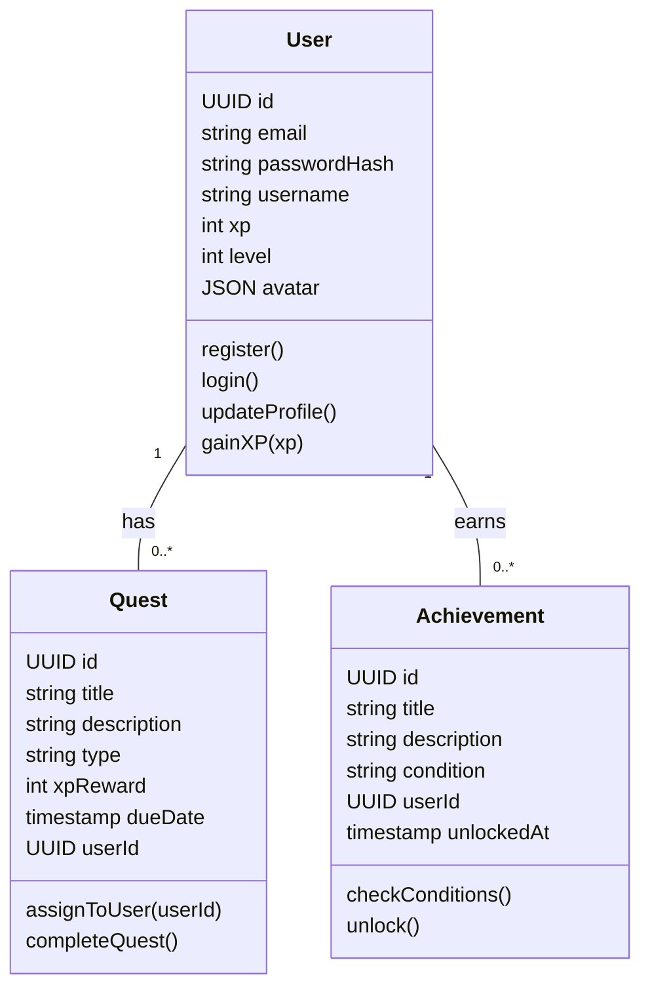
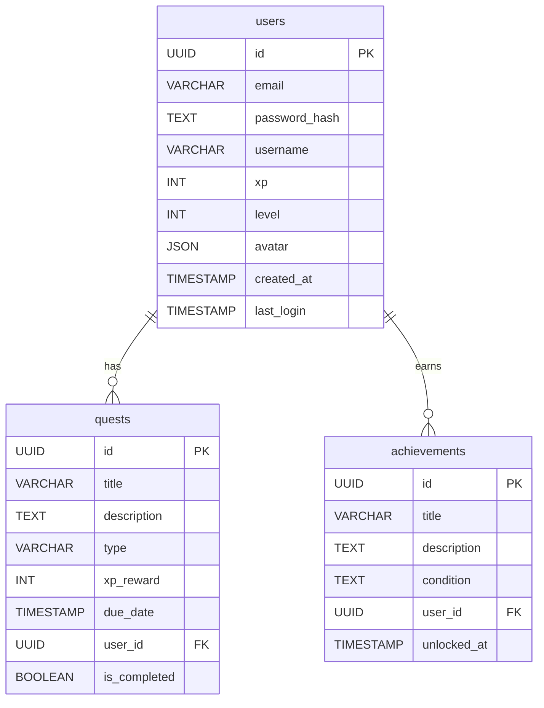

# 🏋️‍♀️ PixelPump – Gamified Fitness App

Welcome to **PixelPump**, a gamified fitness app where users complete daily and weekly quests to gain experience, unlock badges, and customize their avatar. This document summarizes the functional requirements, technical architecture, and development practices for the project.

---

## 📌 Table of Contents

- [🚀 Objective](#objective)
- [✅ Prioritized User Stories (MoSCoW)](#prioritized-user-stories-moscow)
- [📡 API Documentation](#api-documentation)
- [💻 Front-End Components](#front-end-components)
- [📊 UML / Database Diagrams](#uml--database-diagrams)
- [🧬 SCM and QA Strategy](#scm-and-qa-strategy)
- [📦 Tech Stack](#tech-stack)

---

## 🚀 Objective

To offer an engaging fitness experience through gamification elements such as quests, levels, badges, and avatar customization.

---

## ✅ Prioritized User Stories (MoSCoW)

### 🎯 Must Have

- **User Onboarding**: Create account and define goals
- **Daily/Weekly Quest System**: Assign recurring quests
- **XP and Level System**: Gain XP and level up
- **Basic User Profile**: View stats and completed quests
- **Achievement Badges**: Earn rewards for reaching milestones

### ✅ Should Have

- **Avatar Customization**: Customize avatar based on level
- **Progress Dashboard**: Weekly/monthly activity summary

### ✅ Could Have

- **Quest Streak System**: Rewards for daily consistency
- **Basic Reminders**: Notifications for pending quests

### ❌ Won’t Have (MVP)

- Social features, leaderboard
- Wearable integrations
- In-app purchases / ads
- Advanced analytics (VO2 max, HRV)

---

## 📡 API Documentation

### 🌐 External

- **Firebase Auth** – Secure authentication
- **Gravatar API** *(optional)* – Email-based avatar image

### 🧠 Internal

#### 🔐 Auth
- `POST /api/auth/register` – Register new user
- `POST /api/auth/login` – User login

#### 👤 Users
- `GET /api/users/:id` – User profile info
- `PUT /api/users/:id/avatar` – Update avatar
- `PATCH /api/users/:id/xp` – Add XP

#### 📅 Quests
- `GET /api/quests?userId=...` – Get assigned quests
- `POST /api/quests/:id/complete` – Mark quest as completed
- `POST /api/quests/assign/daily` – Auto assign quests (internal)

#### 🏆 Achievements
- `GET /api/achievements/:userId` – Get unlocked achievements
- `POST /api/achievements/check` – Check for unlocks

#### 📈 Progress
- `GET /api/users/:id/progress` – XP, level, activity stats

---

## 💻 Front-End Components

| Component           | Description                                       |
|---------------------|---------------------------------------------------|
| `LoginScreen`       | Handles authentication via Firebase or API        |
| `Dashboard`         | Main hub showing XP, stats, avatar                |
| `QuestList`         | Displays assigned daily and weekly quests         |
| `QuestCard`         | Interactive component to complete quests          |
| `AvatarViewer`      | Interface to customize and preview avatar         |
| `ProgressTracker`   | Shows XP gain and progress history                |
| `AchievementDisplay`| Displays unlocked badges                          |
| `Settings`          | User preferences and profile updates              |

### 🔄 Component Interactions

- `Dashboard` connects: `QuestList`, `ProgressTracker`, `AchievementDisplay`, `AvatarViewer`
- `Settings` controls updates that reflect in `Dashboard`

---

## 📊 UML / Database Diagrams

### 📦 Class Diagram (web front-end)

### 🗄️ Entity-Relationship Diagram

> *Tip: For GitHub display, use Mermaid Live Editor or VS Code Mermaid Preview plugin.*

---

## 🧬 SCM and QA Strategy

### 🔀 Git Flow

| Branch       | Role                            |
|--------------|---------------------------------|
| `main`       | Stable release                  |
| `dev`        | Continuous integration          |
| `feature/*`  | Feature-specific branches       |
| `hotfix/*`   | Urgent fixes from `main`        |

### ✅ Planned Tests

| Test Type           | Tools                        |
|---------------------|------------------------------|
| **Unit Tests**      | Jest (Node.js)               |
| **Integration**     | Supertest + Jest + SQLite    |
| **Manual Testing**  | Postman                      |
| **End-to-End**      | Playwright / Cypress (later) |

### 📦 CI/CD

| Environment | Description                          |
|-------------|--------------------------------------|
| Staging     | Auto-deploy from `dev`               |
| Production  | Manual deploy from `main`            |

---

## 📦 Tech Stack

- **Back-End**: Node.js + Express
- **Database**: PostgreSQL (via Supabase or similar)
- **Front-End**: React.js (SPA)
- **Auth**: Firebase or custom JWT
- **CI/CD**: GitHub Actions, Vercel/Render

---